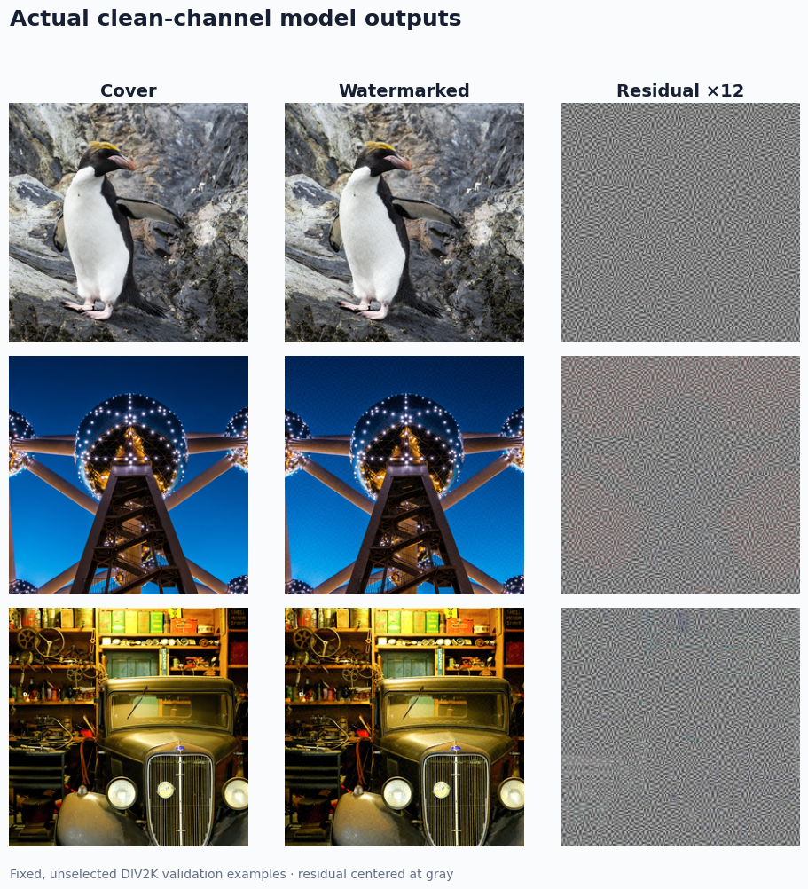
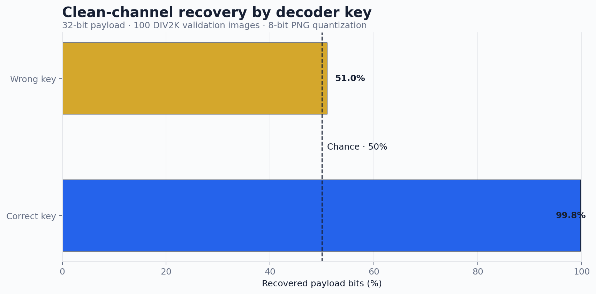
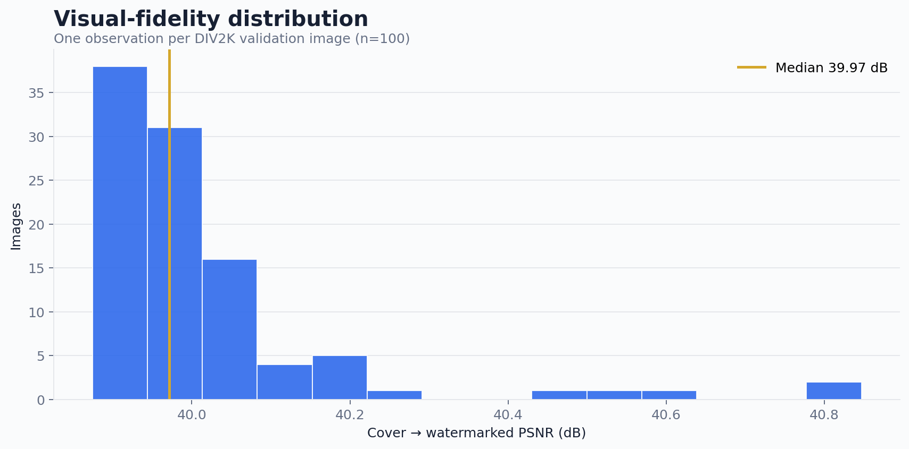
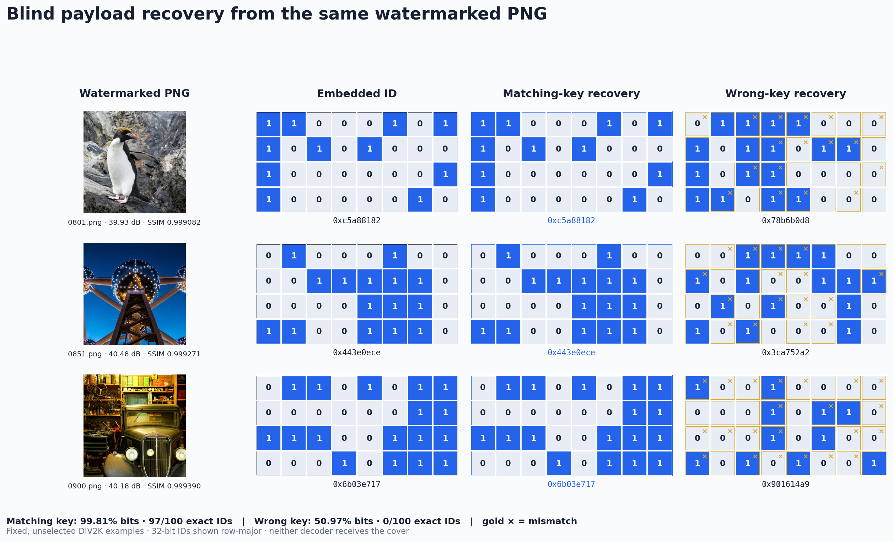

# SpectralMark

### Blind, keyed 32-bit provenance watermarks with learned block-DCT host cancellation

A compact PyTorch system that writes a keyed owner/provenance ID into an image,
then recovers it blindly from the watermarked image alone.

Actual outputs from three fixed, unselected DIV2K validation images. The residual is amplified 12× and centered at gray; each row reports its own PSNR and recovered-bit accuracy.

## Verified results

The committed showcase checkpoint was trained for 500 steps on a deterministic
2,000-image subset of COCO val2017, then evaluated on all 100 disjoint DIV2K
validation images. Evaluation is FP32 after differentiable 8-bit quantization;
the supported transport is clean, lossless PNG.

| Measurement | Result |
|---|---:|
| Clean bit accuracy | **99.81%** |
| Exact 32-bit messages | **97 / 100** |
| Cover → watermarked PSNR | **40.016 dB** |
| Cover → watermarked SSIM | **0.998907** |
| Wrong-key bit accuracy | **50.97%** |
| Learned parameters | **19,091** |
| Evaluation cohort | **100 images** |

Every value above is backed by [results/showcase.json](results/showcase.json).
The fixed filenames and SHA-256 hashes are in
[results/showcase_manifest.json](results/showcase_manifest.json), and the
83 KB checkpoint is [checkpoints/showcase.pt](checkpoints/showcase.pt).

<table>
<tr>
<td width="50%"></td>
<td width="50%"></td>
</tr>
</table>

The correct key recovers nearly every payload bit; a wrong key stays near the
50% random-guess baseline. Across the fixed 100-image cohort, fidelity is
concentrated around the configured 40 dB budget.

## Payload recovery by key

Actual checkpoint outputs for three fixed, unselected DIV2K images. The recovered output is a 32-bit provenance ID shown as 4×8 bit cells, not an RGB reconstruction. Both decoders receive the same watermarked PNG and no cover; each gold × marks a bit mismatch.

## Technical contributions

- **Balanced keyed carriers.** A BLAKE2b-derived seed maps all 1,024 image
  blocks evenly across 32 payload bits, then assigns one of ten mid-frequency
  DCT coordinates and a BPSK polarity to each block.
- **Content-adaptive embedding.** A compact CNN predicts a bounded positive
  coefficient gain for every 8×8 block from local image texture.
- **Blind host cancellation.** The decoder predicts each natural carrier value
  from the other 63 DCT coefficients, subtracts it, de-spreads the keyed
  observations, and averages all repeats for each bit.
- **Quantization-aware optimization.** Straight-through 8-bit quantization is
  included during training while bit BCE, PSNR-budget excess, host prediction,
  low-frequency residual leakage, and gain-map smoothness are optimized jointly.

## Architecture

Each 8×8 block carries one keyed BPSK observation. The key determines which
payload bit, mid-frequency DCT coordinate, and polarity belong to every block.
A small CNN predicts a positive per-block gain from image texture. At decode
time, an MLP estimates the natural host coefficient from the other 63 DCT
coefficients; subtracting that estimate suppresses cover interference before
the repeated observations are de-spread and averaged.

~~~mermaid
flowchart LR
    A[RGB cover] --> B[8×8 luminance DCT]
    A --> C[Texture-gain CNN]
    K[User key] --> D[Block / bit / frequency / polarity map]
    M[32-bit ID] --> E[BPSK coefficient writer]
    B --> E
    C --> E
    D --> E
    E --> F[Inverse DCT + 8-bit quantization]
    F --> G[Watermarked PNG]

    G --> H[8×8 luminance DCT]
    H --> I[Selected carrier coefficient]
    H --> J[Other 63 coefficients]
    J --> L[Learned host predictor]
    I --> N[Host subtraction]
    L --> N
    D --> O[Polarity de-spread + repeat average]
    N --> O
    O --> P[32 bit logits]
~~~

The joint objective combines bit BCE, a hinge above the configured PSNR
budget, host-coefficient prediction, low-frequency residual leakage, and
gain-map smoothness.

## Quick start

~~~bash
git clone https://github.com/Wolfy024/Research.git
cd Research

python -m venv .venv
source .venv/bin/activate
python -m pip install --upgrade pip
python -m pip install -e ".[dev,viz]"

ruff check .
pytest
python -m neural_watermark smoke
~~~

The smoke command trains on procedural textures only to validate installation
and gradient flow. Reported metrics use the committed COCO/DIV2K evaluation
rather than the procedural smoke dataset.

## Embed and extract

The bundled checkpoint accepts 256×256 inputs and a 32-bit hexadecimal message.
Embedding always writes PNG because the project supports a lossless channel.

~~~bash
spectral-watermark embed \
  --checkpoint checkpoints/showcase.pt \
  --input cover.jpg \
  --output watermarked.png \
  --message deadbeef \
  --key wolfy024-provenance-v1

spectral-watermark extract \
  --checkpoint checkpoints/showcase.pt \
  --input watermarked.png \
  --key wolfy024-provenance-v1
~~~

The decoder sees only the watermarked image and matching key. The original
cover is not used during extraction.

## Train and evaluate

Edit [configs/default.json](configs/default.json), then point the CLI at a
folder containing images:

~~~bash
spectral-watermark train \
  --config configs/default.json \
  --data-dir data/train \
  --checkpoint runs/my-model/latest.pt \
  --device auto

spectral-watermark evaluate \
  --checkpoint runs/my-model/latest.pt \
  --data-dir data/eval \
  --output results/my-evaluation.json \
  --device auto
~~~

To reproduce the committed cross-dataset run and all README figures:

~~~bash
python -m scripts.build_showcase \
  --train-dir data/coco/val2017 \
  --eval-dir data/div2k/DIV2K_valid_HR \
  --steps 500 \
  --train-images 2000 \
  --batch-size 8 \
  --device cuda
~~~

See [DATA.md](DATA.md) for cohort rules and [MODEL_CARD.md](MODEL_CARD.md) for
intended use, metrics, and limitations.

## Python API

~~~python
import torch

from neural_watermark import ModelConfig, NeuralWatermarker
from neural_watermark.training import load_checkpoint

device = torch.device("cuda" if torch.cuda.is_available() else "cpu")
model, _ = load_checkpoint("checkpoints/showcase.pt", device)

cover = torch.rand(1, 3, 256, 256, device=device)
bits = torch.randint(0, 2, (1, 32), device=device).float()

with torch.inference_mode():
    watermarked = model.embed(cover, bits)["watermarked"]
    recovered_bits = model.decode(watermarked)
~~~

## Repository layout

~~~text
neural_watermark/
  carriers.py       block DCT, keyed assignments, de-spreading
  models.py         texture gains, host predictor, blind model API
  losses.py         PSNR-budget and recovery objective
  metrics.py        PSNR, SSIM, BER, exact-message metrics
  data.py           deterministic loading and PNG I/O
  training.py       training, evaluation, checkpoints, evidence
  cli.py            smoke, train, evaluate, embed, extract
scripts/
  build_showcase.py fixed training/evaluation and figure pipeline
configs/             checked-in experiment configuration
checkpoints/         small reproducible showcase checkpoint
results/             manifest and machine-readable evidence
assets/              charts and actual model outputs
tests/               CPU-friendly regression suite
~~~

## Scope and limitations

- Clean, lossless PNG is the only evaluated channel.
- JPEG recompression, blur, resizing, cropping, and adversarial attacks are not
  supported or claimed.
- The user key controls carrier placement; it is not a cryptographic signature,
  encryption scheme, DRM system, or proof of authorship.
- Inputs are center-fit to 256×256. Shipping at arbitrary resolution needs a
  tiling or multiscale policy that is not implemented here.
- Results cover one checkpoint and one fixed 100-image DIV2K cohort.
- COCO and DIV2K images are not redistributed; obtain them under their original
  dataset terms.

For threat-model details, read [SECURITY.md](SECURITY.md).

## License

Code is released under the [MIT License](LICENSE). Dataset images remain under
their source licenses.
